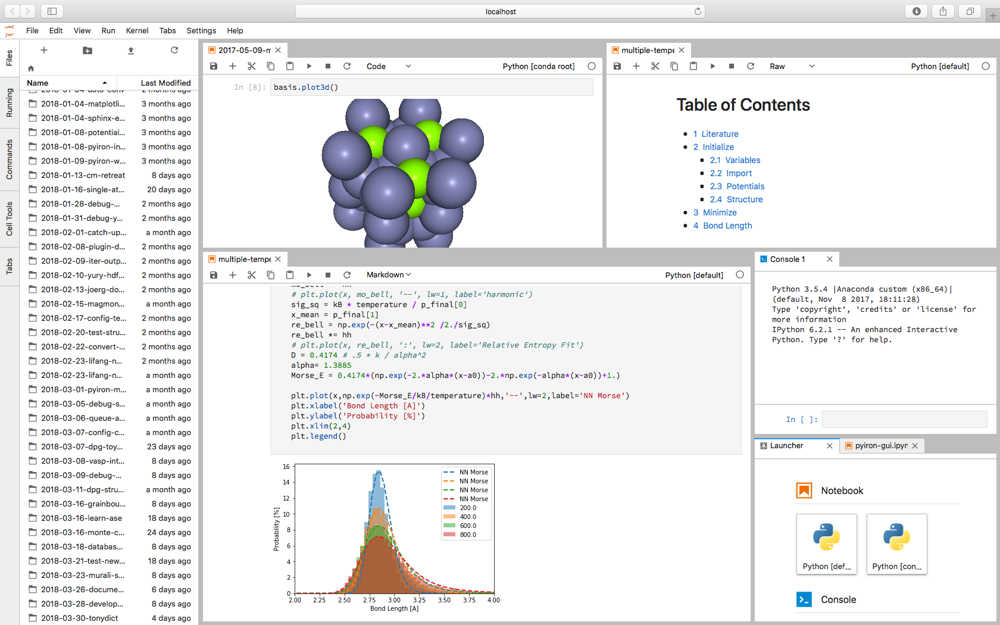

pyiron
======

.. image:: https://coveralls.io/repos/github/pyiron/pyiron/badge.svg?branch=master
    :target: https://coveralls.io/github/pyiron/pyiron?branch=master
    :alt: Coverage Status

.. image:: https://api.codacy.com/project/badge/Grade/c513254f10004df5a1f5c76425c6584b
    :target: https://app.codacy.com/app/pyiron-runner/pyiron?utm_source=github.com&utm_medium=referral&utm_content=pyiron/pyiron&utm_campaign=Badge_Grade_Settings
    :alt: Codacy Badge

.. image:: https://anaconda.org/conda-forge/pyiron/badges/latest_release_date.svg
    :target: https://anaconda.org/conda-forge/pyiron/
    :alt: Release_Date

.. image:: https://github.com/pyiron/pyiron/workflows/Python%20package/badge.svg
    :target: https://github.com/pyiron//pyiron/actions
    :alt: Build Status

.. image:: https://anaconda.org/conda-forge/pyiron/badges/downloads.svg
    :target: https://anaconda.org/conda-forge/pyiron/
    :alt: Downloads

.. image:: https://readthedocs.org/projects/pyiron/badge/?version=latest
    :target: https://pyiron.readthedocs.io/en/latest/?badge=latest
    :alt: Documentation Status

pyiron - an integrated development environment (IDE) for computational materials science. It combines several tools in a common platform:

 - Atomic structure objects – compatible to the `Atomic Simulation Environment (ASE) <https://wiki.fysik.dtu.dk/ase/>`_.
 - Atomistic simulation codes – like `LAMMPS <http://lammps.sandia.gov>`_ and `VASP <https://www.vasp.at>`_.
 - Feedback Loops – to construct dynamic simulation life cycles.
 - Hierarchical data management – interfacing with storage resources like SQL and `HDF5 <https://support.hdfgroup.org/HDF5/>`_.
 - Integrated visualization – based on `NGLview <https://github.com/arose/nglview>`_.
 - Interactive simulation protocols - based on `Jupyter notebooks <http://jupyter.org>`_.
 - Object oriented job management – for scaling complex simulation protocols from single jobs to high-throughput simulations.

pyiron (called pyron) is developed in the `Computational Materials Design department <https://www.mpie.de/CM>`_ of `Joerg Neugebauer <https://www.mpie.de/person/43010/2763386>`_ at the `Max Planck Institut für Eisenforschung (Max Planck Institute for iron research) <https://www.mpie.de/2281/en>`_. While its original focus was to provide a framework to develop and run complex simulation protocols as needed for ab initio thermodynamics it quickly evolved into a versatile tool to manage a wide variety of simulation tasks. In 2016 the `Interdisciplinary Centre for Advanced Materials Simulation (ICAMS) <http://www.icams.de>`_ joined the development of the framework with a specific focus on high throughput applications. In 2018 pyiron was released as open-source project.
See the `Documentation <http://pyiron.org>`_ page for more details.

Installation
------------
You can test pyiron on `Mybinder.org (beta) <https://mybinder.org/v2/gh/pyiron/pyiron/master?urlpath=lab>`_.
For a local installation we recommend to install pyiron inside an `anaconda <https://www.anaconda.com>`_  environment::

    conda install -c conda-forge pyiron

After the installation of pyiron you need to configure pyiron. The default configuration can be generated automatically. Start a new Python session and import pyiron::

   > import pyiron
   > pyiron.install()
   >>> It appears that pyiron is not yet configured, do you want to create a default start configuration (recommended: yes). [yes/no]:
   > yes
   > exit()

See the `Documentation-Installation <https://pyiron.readthedocs.io/en/latest/source/installation.html>`_ page for more details.

Example
-------
After the successful configuration you can start your first pyiron calculation. Navigate to the the projects directory and start a jupyter notebook or jupyter lab session correspondingly::

    cd ~/pyiron/projects
    jupyter notebook

Open a new jupyter notebook and inside the notebook you can now validate your pyiron calculation by creating a test project, setting up an initial structure of bcc Fe and visualize it using NGLview::

    from pyiron import Project
    pr = Project('test')
    structure = pr.create_structure('Fe', 'bcc', 2.78)
    structure.plot3d()

Finally a first lammps calculation can be executed by::

    job = pr.create_job(job_type=pr.job_type.Lammps, job_name='lammpstestjob')
    job.structure = structure
    job.potential = job.list_potentials()[0]
    job.run()

Getting started:
----------------
Test pyiron with mybinder:

.. image:: https://mybinder.org/badge_logo.svg
     :target: https://mybinder.org/v2/gh/pyiron/pyiron/master
     :alt: mybinder

License and Acknowledgments
---------------------------
``pyiron`` is licensed under the BSD license.

If you use pyiron in your scientific work, `please consider citing <http://www.sciencedirect.com/science/article/pii/S0927025618304786>`_ ::

  @article{pyiron-paper,
    title = {pyiron: An integrated development environment for computational materials science},
    journal = {Computational Materials Science},
    volume = {163},
    pages = {24 - 36},
    year = {2019},
    issn = {0927-0256},
    doi = {https://doi.org/10.1016/j.commatsci.2018.07.043},
    url = {http://www.sciencedirect.com/science/article/pii/S0927025618304786},
    author = {Jan Janssen and Sudarsan Surendralal and Yury Lysogorskiy and Mira Todorova and Tilmann Hickel and Ralf Drautz and Jörg Neugebauer},
    keywords = {Modelling workflow, Integrated development environment, Complex simulation protocols},
  }
