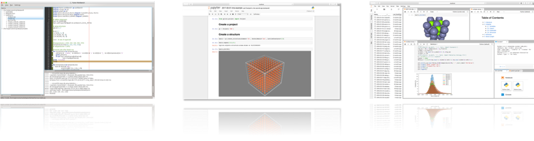

.. pyiron documentation master file

.. _index:

======
pyiron
======

.. image:: https://github.com/pyiron/pyiron/workflows/Python%20package/badge.svg
    :target: https://github.com/pyiron//pyiron/actions
    :alt: Build Status

.. image:: https://anaconda.org/conda-forge/pyiron/badges/downloads.svg

.. image:: https://anaconda.org/conda-forge/pyiron/badges/latest_release_date.svg

pyiron - an integrated development environment (IDE) for computational materials science. It combines several tools in a common platform:

• Atomic structure objects – compatible to the `Atomic Simulation Environment (ASE) <https://wiki.fysik.dtu.dk/ase/>`_.

• Atomistic simulation codes – like `LAMMPS <http://lammps.sandia.gov>`_ and `VASP <https://www.vasp.at>`_.

• Feedback Loops – to construct dynamic simulation life cycles.

• Hierarchical data management – interfacing with storage resources like SQL and `HDF5 <https://support.hdfgroup.org/HDF5/>`_.

• Integrated visualization – based on `NGLview <https://github.com/arose/nglview>`_.

• Interactive simulation protocols - based on `Jupyter notebooks <http://jupyter.org>`_.

• Object oriented job management – for scaling complex simulation protocols from single jobs to high-throughput simulations.

pyiron (called pyron) is developed in the `Computational Materials Design department <https://www.mpie.de/CM>`_ of `Joerg Neugebauer <https://www.mpie.de/person/43010/2763386>`_ at the `Max Planck Institut für Eisenforschung (Max Planck Institute for iron research) <https://www.mpie.de/2281/en>`_. While its original focus was to provide a framework to develop and run complex simulation protocols as needed for ab initio thermodynamics it quickly evolved into a versatile tool to manage a wide variety of simulation tasks. In 2016 the `Interdisciplinary Centre for Advanced Materials Simulation (ICAMS) <http://www.icams.de>`_ joined the development of the framework with a specific focus on high throughput applications. In 2018 pyiron was released as open-source project.

.. note::

    **pyiron 0.X – Disclaimer**: With the first open source release of pyiron under the `BSD license <https://github.com/pyiron/pyiron/blob/master/LICENSE>`_ we provide a fully functional core platform. We are currently working on finalizing various plugins, e.g. to enhance high throughput simulations, for `Computational Phase Studies <https://www.mpie.de/2891195/computational_phase_studies>`_, and `Electrochemistry and Corrosion <https://www.mpie.de/3119070/Corrosion>`_. The code is published on `Github.org <https://github.com/pyiron>`_, `PyPi.org <https://pypi.org/user/pyiron/>`_ and `Anaconda.org <https://anaconda.org/pyiron>`_

**************
Explore pyiron
**************
We provide various options to install, explore and run pyiron:

* :ref:`Workstation Installation (recommeded) <InstallLocal>`: for Windows, Linux or Mac OS X workstations (interface for local VASP executable, support for the latest jupyterlab based GUI)

* :ref:`Mybinder.org (beta) <InstallBinder>`: test pyiron directly in your browser (no VASP license, no visualization, only temporary data storage)

* :ref:`Docker (for demonstration) <InstallDocker>`: requires Docker installation (no VASP license, only temporary data storage)

********************
Join the development
********************
Please contact us if you are interested in using pyiron:

* to interface your simulation code or method

* implementing high-throughput approaches based on atomistic codes

* to learn more about method development and Big Data in material science.

Please also check out the `pyiron contributing guidelines <source/developers.html>`_

******
Citing
******
If you use pyiron in your research, please consider citing the following work:

.. code-block:: bibtex

  @article{pyiron-paper,
    title = {pyiron: An integrated development environment for computational materials science},
    journal = {Computational Materials Science},
    volume = {163},
    pages = {24 - 36},
    year = {2019},
    issn = {0927-0256},
    doi = {https://doi.org/10.1016/j.commatsci.2018.07.043},
    url = {http://www.sciencedirect.com/science/article/pii/S0927025618304786},
    author = {Jan Janssen and Sudarsan Surendralal and Yury Lysogorskiy and Mira Todorova and Tilmann Hickel and Ralf Drautz and Jörg Neugebauer},
    keywords = {Modelling workflow, Integrated development environment, Complex simulation protocols},
  }

Read more about `citing individual modules/ plugins of pyiron and the implemented simulation codes <source/citation.html>`_.

.. toctree::
   :hidden:

   source/about.rst
   source/installation.rst
   source/examples.rst
   Team <https://pyiron.org/team/>
   Collaborators <https://pyiron.org/collaborators/>
   source/commandline.rst
   source/citation.rst
   source/faq.rst
   source/developers.rst
   License (BSD) <https://github.com/pyiron/pyiron/blob/master/LICENSE>
   Module index <https://pyiron.readthedocs.io/en/latest/py-modindex.html>
   Imprint <https://www.mpie.de/impressum>
   Data protection <https://www.mpie.de/3392182/data-protection>
