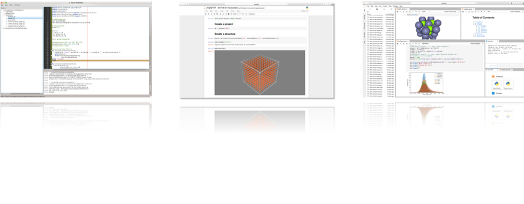

.. pyiron documentation master file

.. _index:

======
pyiron
======

.. image:: https://travis-ci.org/pyiron/pyiron.svg?branch=master
    :target: https://travis-ci.org/pyiron/pyiron

.. image:: https://anaconda.org/pyiron/pyiron/badges/downloads.svg

.. image:: https://anaconda.org/pyiron/pyiron/badges/latest_release_date.svg

pyiron is the integrated development environment for computational materials science. It connects among other things:

• Atomic structure objects – compatible to the `Atomic Simulation Environment (ASE) <https://wiki.fysik.dtu.dk/ase/>`_.

• Atomistic simulation codes – like `LAMMPS <http://lammps.sandia.gov>`_ and `VASP <https://www.vasp.at>`_.

• Feedback Loops – to construct dynamic simulation life cycles.

• Hierarchical data management – interfacing with storage resources like SQL and `HDF5 <https://support.hdfgroup.org/HDF5/>`_.

• Integrated visualization – based on the `NGLview <https://github.com/arose/nglview>`_. 

• Interactive simulation protocols - based on `Jupyter notebooks <http://jupyter.org>`_.

• Object oriented job management – for scaling simulation protocols.

pyiron was initially developed in the `Computational Materials Design department <https://www.mpie.de/CM>`_ of `Joerg Neugebauer <https://www.mpie.de/person/43010/2763386>`_ at the `Max Planck Insitut für Eisenforschung (Max Planck Insitute for iron research) <https://www.mpie.de/2281/en>`_ as a framework for ab initio thermo dynamics. In collaboration with the `Interdisciplinary Centre for Advanced Materials Simulation (ICAMS) <http://www.icams.de>`_ the framework was recently extended for high through put applications resulting in the opensource release of the pyiron. 

.. note::  

    **pyiron 1.0 – Disclaimer**: With the first open source release the pyiron objects are introduced as an abstract class of building blocks for simulation life cycles. While this release is fully scalable in terms of computing resources, we are currently working on finalizing the high throughput extension as well as a set of specialized pyiron plugins for `Computational Phase Studies <https://www.mpie.de/2891195/computational_phase_studies>`_, `Electrochemistry and Corrosion <https://www.mpie.de/3119070/Corrosion>`_.

***********
Test pyiron
***********
We provide various levels of environments to test pyiron: 

* :ref:`Mybinder.org (first try) <InstallBinder>`: test pyiron directly in your browser (no VASP license, no visualization, only temporary data storage) 

* :ref:`Docker (for demonstration) <InstallDocker>`: for demonstration (no VASP license, only temporary data storage)

* :ref:`Local Installation (Workstation) <InstallLocal>`: for Windows, Linux or Mac OS X workstation (interface for local VASP executable, support for the latest jupyterlab based GUI) 

********************
Join the development
********************
We are interested to get in contact with you, if you: 

* Develop your own simulation code or methods on the atomistic scale. 

* Conduct high through put studies in the field of computational material science. 

* Are a student who wants to learn more about method development and Big Data in material science. 

****
News
****
* **Tomorrow:** The pyiron paper is submitted 
* **05.04.2018:** test pyiron on mybinder.org (beta)
* **27.03.2018:** pyiron is available on `anaconda.org <https://anaconda.org/pyiron/>`_ install pyiron using: :code:`conda install -c pyiron -c conda-forge pyiron`
* **27.02.2018:** pyiron is available on `pypi.org <https://pypi.org/user/pyiron/>`_ install pyiron using: :code:`pip install pyiron` 
* **05.12.2017:** The pyiron website goes online. 

.. toctree::
   :hidden:
   
   source/installation.rst
   source/developers.rst
   source/citation.rst
   source/import.rst
   source/faq.rst
   source/examples.rst
   :ref:`modul index <modindex>`
   Imprint <https://www.mpie.de/impressum>

